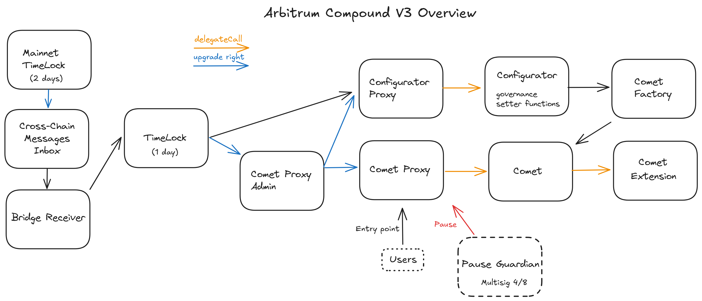

# Summary

Compound III is an EVM compatible protocol that enables supplying of crypto assets as collateral in order to borrow the base asset. Multiple base assets are supported such as USDC.e, USDC, WETH, and USDT. Accounts can also earn interest by supplying the base asset to the protocol. The market logic of each base asset is implemented in respective `Comet`contracts. Those `Comet`s are deployed by the `Comet Factory` using the `Configurator`. The `Configurator` holds the parameters of each market. A new `Comet` contract needs to be deployed every time the parameters of the market change.

# Overview

## Chain

Compound III is deployed on various chains. This review is based on the Arbitrum chain, an Ethereum L2 in Stage 1 according to L2BEAT.

> Chain score: Medium

## Upgradeability

Compound allors for thr upgrade of contracts. Those upgrades can change the logic and implementation of the markets and governance, which can result in the loss of funds or the loss of unclaimed yield. To prevent this upgrades are regulated by on-chain governance on Ethereum mainnet and can be cancelled by a security council on called `ProposalGuardian`.

Non-malicious upgrades can modify market parameters through the `Configurator` contract, which controls how each market functions. These changes could potentially alter future yield calculations or alter the risk exposue of deposited funds. The system includes a `PauseGuardian` (security council) that can immediately freeze markets if suspicious activity is detected.

Upgrades happen through governance proposal on Ethereum Mainnet. After a 2 days delay a `Bridge Receiver` receives messages from the mainnet governance and sends them to a local `TimeLock` that ensures the transactions are only executed during the correct execution period, after an additional 1 day delay.

<<<<<<< HEAD
> Upgradeability score: High
=======
> Risk: High
>>>>>>> 28a1f0b (Rebase on mainnet review)

## Autonomy

The system has one dependency. The protocol uses Chainlink's oracle to get the price of assets. There are no fallback mechanisms if the oracle fails. It may be replaced only with a contract upgrade through a governance proposal (5+ days delay).

> Autonomy score: Low

## Exit Window

Once an upgrade is approved by the governance on the mainnet there is a total delay of 3 days allowing users to react before the proposal can be executed on Arbitrum. Anyone with more than 25'000 Comp can create a proposal, each proposal has a minimum voting time of 3 days and requires at least 400'000 votes to be valid. A malicious upgrade could hijack user funds if it is not blocked by the `ProposalGuardian`.
In addition to that, the tranfers/deposits/withdrawals can be paused by the `PauseGuardian` (Security Council) with no delay, freezing all assets.

> Exit Window score: High

## Accessibility

The frontend of Compound V3 is open source. Instructions to deploy it locally or deploy it
on IPFS are available [here](https://github.com/compound-finance/palisade). There is no registry
of alternative deployments.

> Accessibility score: Medium

# Technical Analysis

Below is an overview of the contracts from the Compound V3 protocol.

⚠️ During our analysis, we noticed many of the contract addresses listed in the [official documentation](https://docs.compound.finance/) are out of date. This is most likely explained by the high frequency of updates to the implementation contracts. The list below was last updated on the 20th of February 2025.

## Contracts

| Contract Name                    | Address                                                                                                              |
| -------------------------------- | -------------------------------------------------------------------------------------------------------------------- |
| cUSDC.ev3 (Comet Proxy)          | [0xA5EDBDD9646f8dFF606d7448e414884C7d905dCA](https://arbiscan.io/address/0xc3d688B66703497DAA19211EEdff47f25384cdc3) |
| cUSDC.ev3 (Comet Implementation) | [0x75E6946E4d3A374F94232Dc0fbB6240Ae217e869](https://arbiscan.io/address/0x75E6946E4d3A374F94232Dc0fbB6240Ae217e869) |
| cUSDC.ev3 Ext                    | [0x1B2E88cC7365d90e7E81392432482925BD8437E9](https://arbiscan.io/address/0x1B2E88cC7365d90e7E81392432482925BD8437E9) |
| cUSDCv3 (Comet Proxy)            | [0x9c4ec768c28520B50860ea7a15bd7213a9fF58bf](https://arbiscan.io/address/0x9c4ec768c28520B50860ea7a15bd7213a9fF58bf) |
| cUSDCv3 (Comet Implementation)   | [0x7AB43dfe0f5DF2C0BEFb3267AD4fAa773b2c05a1](https://arbiscan.io/address/0x7AB43dfe0f5DF2C0BEFb3267AD4fAa773b2c05a1) |
| cUSDCv3 Ext                      | [0x1B2E88cC7365d90e7E81392432482925BD8437E9](https://arbiscan.io/address/0x1B2E88cC7365d90e7E81392432482925BD8437E9) |
| WETH (Comet Proxy)               | [0x6f7D514bbD4aFf3BcD1140B7344b32f063dEe486](https://arbiscan.io/address/0x6f7D514bbD4aFf3BcD1140B7344b32f063dEe486) |
| WETH (Comet Implementation)      | [0x6493C8f4da3D6c77aF93412250b353E4c31d0A74](https://arbiscan.io/address/0x6493C8f4da3D6c77aF93412250b353E4c31d0A74) |
| WETH Ext                         | [0x5404872d8f2e24b230EC9B9eC64E3855F637FB93](https://arbiscan.io/address/0x5404872d8f2e24b230EC9B9eC64E3855F637FB93) |
| USDT (Comet Proxy)               | [0xd98Be00b5D27fc98112BdE293e487f8D4cA57d07](https://arbiscan.io/address/0xd98Be00b5D27fc98112BdE293e487f8D4cA57d07) |
| USDT (Comet Implementation)      | [0x4fc5BA5a2CeDec9Ccf0C0a0ca90b59fFbB6B7BD5](https://arbiscan.io/address/0x4fc5BA5a2CeDec9Ccf0C0a0ca90b59fFbB6B7BD5) |
| USDT Ext                         | [0x698A949f3b4f7a5DdE236106F25Fa0eAcA0FcEF1](https://arbiscan.io/address/0x698A949f3b4f7a5DdE236106F25Fa0eAcA0FcEF1) |
| Bulker                           | [0xbdE8F31D2DdDA895264e27DD990faB3DC87b372d](https://arbiscan.io/address/0xbdE8F31D2DdDA895264e27DD990faB3DC87b372d) |
| Configurator                     | [0xb21b06D71c75973babdE35b49fFDAc3F82Ad3775](https://arbiscan.io/address/0xb21b06D71c75973babdE35b49fFDAc3F82Ad3775) |
| Configurator Implementation      | [0x8495AF03fb797E2965bCB42Cb0693e1c15614798](https://arbiscan.io/address/0x8495AF03fb797E2965bCB42Cb0693e1c15614798) |
| Proxy Admin                      | [0xD10b40fF1D92e2267D099Da3509253D9Da4D715e](https://arbiscan.io/address/0xD10b40fF1D92e2267D099Da3509253D9Da4D715e) |
| Comet Factory                    | [0xe2AA5194E45B043AfdD6E98F467c0B1c13484ae9](https://arbiscan.io/address/0xe2AA5194E45B043AfdD6E98F467c0B1c13484ae9) |
| Rewards                          | [0x88730d254A2f7e6AC8388c3198aFd694bA9f7fae](https://arbiscan.io/address/0x88730d254A2f7e6AC8388c3198aFd694bA9f7fae) |
| TimeLock                         | [0x3fB4d38ea7EC20D91917c09591490Eeda38Cf88A](https://arbiscan.io/address/0x3fB4d38ea7EC20D91917c09591490Eeda38Cf88A) |
| Bridge Receiver                  | [0x42480C37B249e33aABaf4c22B20235656bd38068](https://arbiscan.io/address/0x42480C37B249e33aABaf4c22B20235656bd38068) |

## Permission owners

| Name                   | Account                                                                                                               | Type         |
| ---------------------- | --------------------------------------------------------------------------------------------------------------------- | ------------ |
| Pause Guardian         | [0x78E6317DD6D43DdbDa00Dce32C2CbaFc99361a9d](https://etherscan.io/address/0x78E6317DD6D43DdbDa00Dce32C2CbaFc99361a9d) | Multisig 4/7 |
| Arbitrum TimeLock      | [0x3fB4d38ea7EC20D91917c09591490Eeda38Cf88A](https://etherscan.io/address/0x3fB4d38ea7EC20D91917c09591490Eeda38Cf88A) | Contract     |
| ArbitrumBridgeReceiver | [0x42480C37B249e33aABaf4c22B20235656bd38068](https://etherscan.io/address/0x42480C37B249e33aABaf4c22B20235656bd38068) | Contract     |

## Permissions

| Contract                      | Function                              | Impact                                                                                                                                                                                                                                                                                                                                                                                                                                                    | Owner                                           |
| ----------------------------- | ------------------------------------- | --------------------------------------------------------------------------------------------------------------------------------------------------------------------------------------------------------------------------------------------------------------------------------------------------------------------------------------------------------------------------------------------------------------------------------------------------------- | ----------------------------------------------- |
| Comet Proxy                   | changeAdmin                           | Updates the admin of this proxy contract. The admin can update the implementation contract. The new admin would replace the `ProxyAdmin` contract, it could be used if the `ProxyAdmin` contract is upgraded/replaced.                                                                                                                                                                                                                                    | ProxyAdmin                                      |
| Comet Proxy                   | upgradeTo                             | Triggers the update of the `Comet Implementation` contract with a new contract.                                                                                                                                                                                                                                                                                                                                                                           | ProxyAdmin                                      |
| Comet Proxy                   | upgradeToAndCall                      | Triggers the update of the `Comet Implementation` contract with a new contract and then calls a function in the new contract.                                                                                                                                                                                                                                                                                                                             | ProxyAdmin                                      |
| Comet Implementation          | pause                                 | This function pauses the specified protocol functionality in the event of an unforeseen vulnerability. Deposits, transfers, and withdrawals may be paused. This may be called by either the DAO or the Pause Guardian.                                                                                                                                                                                                                                    | Arbitrum TimeLock (Mainnet DAO) & PauseGuardian |
| Comet Implementation          | withdrawReserves                      | Allows governance to withdraw base token reserves from the protocol and send them to a specified address.                                                                                                                                                                                                                                                                                                                                                 | Arbitrum TimeLock (Mainnet DAO)                 |
| Comet Implementation          | approveThis                           | Sets the Comet contract’s ERC-20 allowance of an asset for a manager address. The approved address can freely transfer ERC-20 tokens out of the Comet contract.                                                                                                                                                                                                                                                                                           | Arbitrum TimeLock (Mainnet DAO)                 |
| Bulker                        | sweepToken                            | Transfers an ERC-20 token held by this contract to any other address. Can be used to recover/use funds sent to the contract by accident as the Bulker is not meant to hold tokens.                                                                                                                                                                                                                                                                        | Arbitrum TimeLock (Mainnet DAO)                 |
| Bulker                        | sweepNativeToken                      | Transfers ETH held by this contract to any other address. Can be used to recover/use funds sent to the contract by accident as the Bulker is not meant to hold ETH.                                                                                                                                                                                                                                                                                       | Arbitrum TimeLock (Mainnet DAO)                 |
| Bulker                        | transferAdmin                         | Transfers admin rights on the bulker. The only admin permissions are sweeping tokens from the contract.                                                                                                                                                                                                                                                                                                                                                   | Arbitrum TimeLock (Mainnet DAO)                 |
| Configurator (Proxy)          | changeAdmin                           | Update the admin of this proxy contract. The admin can update the implementation contract. The new admin would replace the `ProxyAdmin` contract, it could be used if the `ProxyAdmin` contract is upgraded/replaced.                                                                                                                                                                                                                                     | Arbitrum TimeLock (Mainnet DAO)                 |
| Configurator (Proxy)          | upgradeTo                             | Triggers the update of the `Congiruator Implementation` contract with a new contract.                                                                                                                                                                                                                                                                                                                                                                     | Arbitrum TimeLock (Mainnet DAO)                 |
| Configurator (Proxy)          | upgradeToAndCall                      | Triggers the update of the `Congiruator Implementation` contract with a new contract and then calls a function in the new contract.                                                                                                                                                                                                                                                                                                                       | Arbitrum TimeLock (Mainnet DAO)                 |
| Configurator (Implementation) | setFactory                            | Sets the official contract address of the `Comet Factory`.                                                                                                                                                                                                                                                                                                                                                                                                | Arbitrum TimeLock (Mainnet DAO)                 |
| Configurator (Implementation) | setConfiguration                      | Sets the entire Configuration for a `Comet Proxy` contract.                                                                                                                                                                                                                                                                                                                                                                                               | Arbitrum TimeLock (Mainnet DAO)                 |
| Configurator (Implementation) | setGovernor                           | Sets the official contract address of the Compound III protocol Governor for subsequent proposals. This can be used when the Governance is updated.                                                                                                                                                                                                                                                                                                       | Arbitrum TimeLock (Mainnet DAO)                 |
| Configurator (Implementation) | setPauseGuardian                      | Sets the official contract address of the Compound III protocol pause guardian. This address has the power to pause supply, transfer, withdraw, absorb, and buy collateral operations within Compound III.                                                                                                                                                                                                                                                | Arbitrum TimeLock (Mainnet DAO)                 |
| Configurator (Implementation) | setBaseTokenPriceFeed                 | Sets the official contract address of the price feed of the protocol base asset. This can be used to change the oracle used for a given base asset. An abusive update could point to a malicious price feed and put user's funds at risk.                                                                                                                                                                                                                 | Arbitrum TimeLock (Mainnet DAO)                 |
| Configurator (Implementation) | setExtensionDelegate                  | Sets the official contract address of the protocol’s `Comet` extension delegate. The methods in `CometExt` are able to be called via the same proxy as `Comet`. The extension contract is used for auxiliary functions, to reduce the size of the original `Comet (Implementation)` contract. A malicious extension contract could have the same impact as a malicious `Comet (Implementation)` and steal users' funds.                                   | Arbitrum TimeLock (Mainnet DAO)                 |
| Configurator (Implementation) | setSupplyKink                         | Sets the supply interest rate utilization curve kink for the Compound III base asset. The kink is an utilization rate of the base asset, above which the interest rate increases more rapidly. An overly low supply kink might lead to excessive interest accrual, discouraging deposits, while a high borrow kink might enable unsustainably cheap borrowing, increasing risk exposure.                                                                  | Arbitrum TimeLock (Mainnet DAO)                 |
| Configurator (Implementation) | setSupplyPerYearInterestRateSlopeLow  | Sets the supply interest rate slope low bound in the approximate amount of seconds in one year. This slope dictates how quickly interest rates change for suppliers when the utilization is under the kink.                                                                                                                                                                                                                                               | Arbitrum TimeLock (Mainnet DAO)                 |
| Configurator (Implementation) | setSupplyPerYearInterestRateSlopeHigh | Sets the supply interest rate slope high bound in the approximate amount of seconds in one year. This slope dictates how quickly interest rates change for suppliers when the utilization is above the kink.                                                                                                                                                                                                                                              | Arbitrum TimeLock (Mainnet DAO)                 |
| Configurator (Implementation) | setSupplyPerYearInterestRateBase      | Sets the supply interest rate slope base in the approximate amount of seconds in one year. This is the base interest rate, to which will be added the variable rate as a function of the utilization and kink.                                                                                                                                                                                                                                            | Arbitrum TimeLock (Mainnet DAO)                 |
| Configurator (Implementation) | setBorrowKink                         | Sets the borrow interest rate utilization curve kink for the Compound III base asset. The kink is an utilization rate of the base asset, above which the interest rate increases more rapidly. An overly low supply kink might lead to excessive interest accrual, discouraging deposits, while a high borrow kink might enable unsustainably cheap borrowing, increasing risk exposure.                                                                  | Arbitrum TimeLock (Mainnet DAO)                 |
| Configurator (Implementation) | setBorrowPerYearInterestRateSlopeLow  | Sets the borrow interest rate slope low bound in the approximate amount of seconds in one year. This slope dictates how quickly interest rates change for borrowers when the utilization is under the kink.                                                                                                                                                                                                                                               | Arbitrum TimeLock (Mainnet DAO)                 |
| Configurator (Implementation) | setBorrowPerYearInterestRateSlopeHigh | Sets the borrow interest rate slope high bound in the approximate amount of seconds in one year. This slope dictates how quickly interest rates change for borrowers when the utilization is above the kink.                                                                                                                                                                                                                                              | Arbitrum TimeLock (Mainnet DAO)                 |
| Configurator (Implementation) | setBorrowPerYearInterestRateBase      | Sets the borrow interest rate slope base in the approximate amount of seconds in one year. This is the base interest rate for borrowers, to which will be added the variable rate as a function of the utilization and kink.                                                                                                                                                                                                                              | Arbitrum TimeLock (Mainnet DAO)                 |
| Configurator (Implementation) | setStoreFrontPriceFactor              | Sets the fraction of the liquidation penalty that goes to buyers of collateral instead of the protocol. This factor is used to calculate the discount rate of collateral for sale as part of the account absorption process. This helps determine the “discount” rate that liquidators receive when purchasing collateral. If set too low, liquidators would not be incentivized to liquidate under-collateralized positions, opening a risk of bad debt. | Arbitrum TimeLock (Mainnet DAO)                 |
| Configurator (Implementation) | setBaseTrackingSupplySpeed            | Sets the rate at which base asset supplier accounts accrue rewards. If set too high, the protocol could over-distribute rewards, diluting token value.                                                                                                                                                                                                                                                                                                    | Arbitrum TimeLock (Mainnet DAO)                 |
| Configurator (Implementation) | setBaseTrackingBorrowSpeed            | Sets the rate at which base asset borrower accounts accrue rewards. set too high, the protocol could over-distribute rewards, diluting token value.                                                                                                                                                                                                                                                                                                       | Arbitrum TimeLock (Mainnet DAO)                 |
| Configurator (Implementation) | setBaseMinForRewards                  | Sets the minimum amount of base asset supplied to the protocol in order for accounts to accrue rewards.                                                                                                                                                                                                                                                                                                                                                   | Arbitrum TimeLock (Mainnet DAO)                 |
| Configurator (Implementation) | setBaseBorrowMin                      | Sets the minimum amount of base token that is allowed to be borrowed.                                                                                                                                                                                                                                                                                                                                                                                     | Arbitrum TimeLock (Mainnet DAO)                 |
| Configurator (Implementation) | setTargetReserves                     | Sets the target reserves amount. Once the protocol reaches this amount of reserves of base asset, liquidators cannot buy collateral from the protocol. A target too low could expose the protocol to under-reserved conditions during liquidations, risking insolvency.                                                                                                                                                                                   | Arbitrum TimeLock (Mainnet DAO)                 |
| Configurator (Implementation) | addAsset                              | Adds an asset to the protocol through governance. This involves specifying all necessary risk and collateral parameters for the new asset.                                                                                                                                                                                                                                                                                                                | Arbitrum TimeLock (Mainnet DAO)                 |
| Configurator (Implementation) | updateAsset                           | Modifies an existing asset’s configuration parameters. This can include changes to interest rates and kink parameters.                                                                                                                                                                                                                                                                                                                                    | Arbitrum TimeLock (Mainnet DAO)                 |
| Configurator (Implementation) | updateAssetPriceFeed                  | Updates the price feed contract address for a specific asset. An abusive update could point to a malicious price feed and put user's funds at risk through wrongful liquidations or price manipulation attacks.                                                                                                                                                                                                                                           | Arbitrum TimeLock (Mainnet DAO)                 |
| Configurator (Implementation) | updateAssetBorrowCollateralFactor     | Updates the borrow collateral factor for an asset in the protocol: the fraction of an asset’s value that can be borrowed against. If set too high this can increase the likelihood of defaults. This value is checked for bounds at the time of deployment.                                                                                                                                                                                               | Arbitrum TimeLock (Mainnet DAO)                 |
| Configurator (Implementation) | updateAssetLiquidateCollateralFactor  | Updates the liquidation collateral factor for an asset in the protocol: the threshold at which an asset’s collateral becomes eligible for liquidation. This value is checked for bounds at the time of deployment.                                                                                                                                                                                                                                        | Arbitrum TimeLock (Mainnet DAO)                 |
| Configurator (Implementation) | updateAssetLiquidationFactor          | Updates the liquidation factor for an asset in the protocol, the amount that is paid out to an underwater account upon liquidation. This value is checked for bounds at the time of deployment.                                                                                                                                                                                                                                                           | Arbitrum TimeLock (Mainnet DAO)                 |
| Configurator (Implementation) | updateAssetSupplyCap                  | Sets the maximum amount of an asset that can be supplied to the protocol. Supply transactions will revert if the total supply would be greater than this number as a result.                                                                                                                                                                                                                                                                              | Arbitrum TimeLock (Mainnet DAO)                 |
| Configurator (Implementation) | transferGovernor                      | Changes the address of the Configurator’s Governor. This should only be used when the governance is updated, as a malicious governor would have multiple ways to steal funds using the above functions.                                                                                                                                                                                                                                                   | Arbitrum TimeLock (Mainnet DAO)                 |
| CometProxyAdmin               | changeProxyAdmin                      | Updates the admin of one of the proxy contracts: the account with the rights to upgrade the implementations of `Comet` and `Configurator`. A malicious admin could hijack the whole protocol.                                                                                                                                                                                                                                                             | Arbitrum TimeLock (Mainnet DAO)                 |
| CometProxyAdmin               | upgrade                               | Triggers the update of either a `Comet (Implementation)` contract or `Configurator (Implementation)` contract. A malicious proposal not stopped by the `ProposerGuardian` could use this function to replace a `Comet (Implementation)` contract and steal funds.                                                                                                                                                                                         | Arbitrum TimeLock (Mainnet DAO)                 |
| CometProxyAdmin               | upgradeAndCall                        | Triggers the update of either a `Comet (Implementation)` contract or `Configurator (Implementation)` contract and calls a function in the new contract. A malicious proposal not stopped by the `ProposerGuardian` could use this function to replace a `Comet (Implementation)` contract and steal funds.                                                                                                                                                | Arbitrum TimeLock (Mainnet DAO)                 |
| CometProxyAdmin               | renounceOwnership                     | Abandons ownership of the contract. The DAO would renounce the access to the administrative functions of the contracts, which includes upgrading the `Comet Implementation` and `Configurator Implementation` contracts. Without other prior adaptations this could present a vulnerability as it would freeze the parameters of the `Comet (Implementation)`contracts.                                                                                   | Arbitrum TimeLock (Mainnet DAO)                 |
| CometProxyAdmin               | transferOwnership                     | Updates the owner of the `ProxyAdmin` contract: the account with the rights to change the admin of the proxy and upgrade the implementation contracts.                                                                                                                                                                                                                                                                                                    | Arbitrum TimeLock (Mainnet DAO)                 |
| CometProxyAdmin               | deployAndUpgradeTo                    | Deploy a new `Comet (Implementation)` using the `Configurator` and upgrade the implementation of the `Comet Proxy`. This bundles the transactions to ensure a correct update.                                                                                                                                                                                                                                                                             | Arbitrum TimeLock (Mainnet DAO)                 |
| CometProxyAdmin               | deployUpgradeToAndCall                | Deploy a new `Comet (Implementation)` using the `Configurator` and upgrade the implementation of the `Comet Proxy`, then call a function in the new contract.                                                                                                                                                                                                                                                                                             | Arbitrum TimeLock (Mainnet DAO)                 |
| CometRewards                  | setRewardConfig                       | Set the reward token for a `Comet` instance.                                                                                                                                                                                                                                                                                                                                                                                                              | Arbitrum TimeLock (Mainnet DAO)                 |
| CometRewards                  | withdrawToken                         | Withdraw reward tokens from the contract. This could drain all the tokens held on the contract to any output address if the DAO approves the proposal.                                                                                                                                                                                                                                                                                                    | Arbitrum TimeLock (Mainnet DAO)                 |
| CometRewards                  | transferGovernor                      | Transfers the governor rights to a new address. A malicious governor could withdraw all reward tokens.                                                                                                                                                                                                                                                                                                                                                    | Arbitrum TimeLock (Mainnet DAO)                 |
| TimeLock                      | setDelay                              | Updates the delay to wait between when a proposal is accepted and when it is executed.                                                                                                                                                                                                                                                                                                                                                                    | ArbitrumBridgeReceiver (Mainnet DAO)            |
| TimeLock                      | setPendingAdmin                       | Updates the TimeLock's admin. This can be used if the Governor contract is updated.                                                                                                                                                                                                                                                                                                                                                                       | ArbitrumBridgeReceiver (Mainnet DAO)            |
| TimeLock                      | acceptAdmin                           | Needs to be called by the new (pending) admin to accept the role.                                                                                                                                                                                                                                                                                                                                                                                         | Pending Admin                                   |
| TimeLock                      | queueTransaction                      | Queues a transaction that can be executed once a delay has passed. The current delay is 2 days. This can impact the own TimeLock's settings (change admin, set delays) or interaction with any other contract the DAO has permissions on.                                                                                                                                                                                                                 | ArbitrumBridgeReceiver (Mainnet DAO)            |
| TimeLock                      | cancelTransaction                     | Cancels a pending transaction and removes it from the queue. This allows the DAO to cancel one of its own decision before it is executed.                                                                                                                                                                                                                                                                                                                 | ArbitrumBridgeReceiver (Mainnet DAO)            |
| TimeLock                      | executeTransaction                    | Executes a transaction that was previously queued, if the corresponding delay has passed.                                                                                                                                                                                                                                                                                                                                                                 | Governor (DAO)                                  |

The permissions for all Comet contracts (USDC, WETH, wsETH, USDT, USDS) are similar and therefore only
represented once as `Comet Proxy` and `Comet Implementation`in the table above.

# Security Council

A security council called `Pause Guardian` has the power to pause all deposits, withdrawals, and transfers
in the Arbitrum `Comet` contracts. The guardian is currently a 4/7 multisig made of Compound DAO community members and other trusted entities. The signers are announced [here](https://www.comp.xyz/t/community-multisig-4-of-6-deployment/134/18).

| Requirement                                             | Pause Guardian |
| ------------------------------------------------------- | -------------- |
| At least 7 signers                                      | ✅             |
| At least 51% threshold                                  | ✅             |
| At least 50% non-team signers                           | ✅             |
| Signers are publicly announced (with name or pseudonym) | ✅             |
