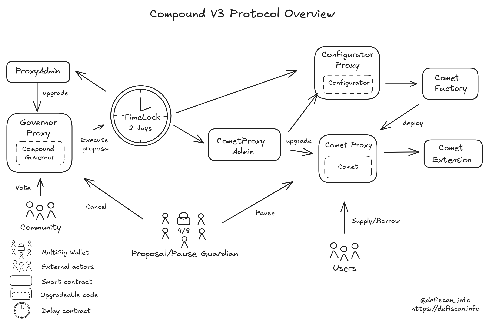
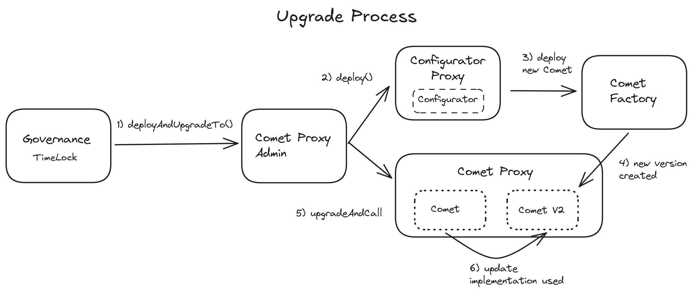

# Summary

Compound-v3 is a lending protocol that accepts a base asset as liquidity and allows borrowing this bas asset with a variety of other assets as collateral. Multiple base assets are supported such as USDC, WETH, USDT, wstETH, and USDS. Each base asset represents an isolated lending market managed by a separate instance of the protocol. Compound governance is able to update various parameters for each of these markets.

# Overview

## Chain

Compound-v3 is deployed on various chains. This review is based on the Ethereum mainnet deployment.

> Chain score: Low

## Upgradeability

The Compound-v3 protocol is fully upgradeable allowing for the update of governance and markets logic and state (specifically the `Governance` and `Comet` implementation contracts). This can result in the loss of funds or unclaimed yield as well as lead to other changes in the expected performance of the protocol.

The permission to upgrade the protocol is controlled by an onchain governance system with `COMP` token holders submitting and voting on respective proposals. A multisig account, the `ProposalGuardian`, has the permission to cancel proposals to mitigate the risk of malicious or otherwise unintended proposals. This role can potentially be abused to censor proposals.

Furthermore, another multisig account, the `PauseGuardian`, has the permission to pause markets, disabling depositing and withdrawing assets, if suspicious activity is detected. This role can potentially be abused to freeze funds and unclaimed yield in the protocol.

> Upgradeability score: High

## Autonomy

The compound-v3 protocol relies on a Chainlink oracle feed to price collateral and base assets in the system. The protocol does not validate asset prices returned by Chainlink or offer a fallback oracle mechanism. The replacement of a stale or untrusted oracle feed requires a Compound governance vote with a delay (see [Exit Window](#exit-window)).

The Chainlink oracle system itself is upgradeable without decentralized ownership over those permissions. This dependency thus introduces centralization risk in the Compound-v3 protocol.

> Autonomy score: High

## Exit Window

Permissions, including protocol upgrades, are controlled by an onchain governance system. `COMP` holders are able to create new proposals (requires 25,000 `COMP`) and vote on proposals (at least 400,000 votes are required for a valid proposal). A minimum voting period of 3 days is enforced as well as a delay of 2 days for the implementation of successful proposals.

While this does not meet the 7-day exit window requirement, malicious or unintended proposals can be intercepted by the `ProposalGuardian` multisig account.

However, both the `ProposalGuardian` and the `PauseGuardian` multisig accounts do not meet the Security Council requirements ([see below](#security-council)).

> Exit Window score: High

## Accessibility

The frontend of Compound V3 is open source. Instructions to deploy it locally or deploy it
on IPFS are available [here](https://github.com/compound-finance/palisade). However, the frontend depends on a separate backend that is accessed through [v3-api.compound.finance/](https://v3-api.compound.finance/). Therefore, self-hosting does not help if the backend is down.
Nonetheless, compound is supported on third-party apps like DeFiSaver. These apps build an acceptable backup solution in case of failure of the official frontend and backend.

> Accessibility score: Low

## Conclusion

The Compound-v3 Ethereum mainnet protocol achieves Low decentralization scores for its _Upgradeability_, _Autonomy_ and _Exit Window_ dimensions. It thus ranks Stage 0.

The protocol could reach Stage 1 by 1) adopting a _Security Council_ setup for the `ProposalGuardian` and `PauseGuardian` multisig accounts, and 2) implementing validity checks and a fallback mechanism around the Chainlink oracle (or Chainlink adopting a _Security Council_ setup for its own multisig account).

> Overall score: Stage 0

# Technical Analysis

Below is an overview of the contracts from the Compound V3 protocol.

## Contracts

⚠️ During our analysis, we noticed many of the contract addresses listed in the [official documentation](https://docs.compound.finance/) are out of date. This is most likely explained by the high frequency of updates to the implementation contracts. The list below was last updated on the 20th of February 2025.

| Contract Name                      | Address                                                                                                               |
| ---------------------------------- | --------------------------------------------------------------------------------------------------------------------- |
| cUSDCv3 (Comet Proxy)              | [0xc3d688B66703497DAA19211EEdff47f25384cdc3](https://etherscan.io/address/0xc3d688B66703497DAA19211EEdff47f25384cdc3) |
| cUSDCv3 (Comet Implementation)     | [0xaeC1954467B6d823A9042E9e9D6E4F40111069a9](https://etherscan.io/address/0xaeC1954467B6d823A9042E9e9D6E4F40111069a9) |
| cUSDCv3 Ext                        | [0x285617313887d43256F852cAE0Ee4de4b68D45B0](https://etherscan.io/address/0x285617313887d43256F852cAE0Ee4de4b68D45B0) |
| cWETHv3 (Comet Proxy)              | [0xA17581A9E3356d9A858b789D68B4d866e593aE94](https://etherscan.io/address/0xA17581A9E3356d9A858b789D68B4d866e593aE94) |
| cWETHv3 (Comet Implementation)     | [0x318b8615643bdae03B7ca63E69b3f06ff1af0bC7](https://etherscan.io/address/0x318b8615643bdae03B7ca63E69b3f06ff1af0bC7) |
| cWETHv3 Ext                        | [0xe2C1F54aFF6b38fD9DF7a69F22cB5fd3ba09F030](https://etherscan.io/address/0xe2C1F54aFF6b38fD9DF7a69F22cB5fd3ba09F030) |
| cUSDTv3 (Comet Proxy)              | [0x3Afdc9BCA9213A35503b077a6072F3D0d5AB0840](https://etherscan.io/address/0x3Afdc9BCA9213A35503b077a6072F3D0d5AB0840) |
| cUSDTv3 (Comet Implementation)     | [0xf930618E2202e6A2a20606AE89ef7406974622e7](https://etherscan.io/address/0xf930618E2202e6A2a20606AE89ef7406974622e7) |
| cUSDTv3 Ext                        | [0x5C58d4479A1E9b2d19EE052143FA73F0ee79A36e](https://etherscan.io/address/0x5C58d4479A1E9b2d19EE052143FA73F0ee79A36e) |
| cwstETHv3 (Comet Proxy)            | [0x3D0bb1ccaB520A66e607822fC55BC921738fAFE3](https://etherscan.io/address/0x3D0bb1ccaB520A66e607822fC55BC921738fAFE3) |
| cwstETHv3 (Comet Implementation)   | [0x25DabAB0c230131aaE9B312Ce1591934f43e024A](https://etherscan.io/address/0x25DabAB0c230131aaE9B312Ce1591934f43e024A) |
| cwstETHv3 Ext                      | [0x995E394b8B2437aC8Ce61Ee0bC610D617962B214](https://etherscan.io/address/0x995E394b8B2437aC8Ce61Ee0bC610D617962B214) |
| cUSDSv3 (Comet Proxy)              | [0x5D409e56D886231aDAf00c8775665AD0f9897b56](https://etherscan.io/address/0x5D409e56D886231aDAf00c8775665AD0f9897b56) |
| cUSDSv3 (Comet Implementation)     | [0xBEBbC5Fc967D8425CF96e97838249eBc9495F9A3](https://etherscan.io/address/0xBEBbC5Fc967D8425CF96e97838249eBc9495F9A3) |
| cUSDSv3 Ext                        | [0x95DeDD64b551F05E9f59a101a519B024b6b116E7](https://etherscan.io/address/0x95DeDD64b551F05E9f59a101a519B024b6b116E7) |
| Bulker                             | [0x74a81F84268744a40FEBc48f8b812a1f188D80C3](https://etherscan.io/address/0x74a81F84268744a40FEBc48f8b812a1f188D80C3) |
| Configurator (Proxy)               | [0x316f9708bB98af7dA9c68C1C3b5e79039cD336E3](https://etherscan.io/address/0x316f9708bB98af7dA9c68C1C3b5e79039cD336E3) |
| Configurator (Implementation)      | [0xcFC1fA6b7ca982176529899D99af6473aD80DF4F](https://etherscan.io/address/0xcFC1fA6b7ca982176529899D99af6473aD80DF4F) |
| Proxy Admin (Comet, Configurator)  | [0x1EC63B5883C3481134FD50D5DAebc83Ecd2E8779](https://etherscan.io/address/0x1EC63B5883C3481134FD50D5DAebc83Ecd2E8779) |
| Proxy Admin (Compound Governor)    | [0x725ed7f44f0888aec1b7630ab1acdced91e0591a](https://etherscan.io/address/0x725ed7f44f0888aec1b7630ab1acdced91e0591a) |
| Comet Factory                      | [0xa7F7De6cCad4D83d81676717053883337aC2c1b4](https://etherscan.io/address/0xa7F7De6cCad4D83d81676717053883337aC2c1b4) |
| Rewards                            | [0x1B0e765F6224C21223AeA2af16c1C46E38885a40](https://etherscan.io/address/0x1B0e765F6224C21223AeA2af16c1C46E38885a40) |
| Compound Governor (Proxy)          | [0x309a862bbC1A00e45506cB8A802D1ff10004c8C0](https://etherscan.io/address/0x309a862bbC1A00e45506cB8A802D1ff10004c8C0) |
| Compound Governor (Implementation) | [0x501Eb63A2120418C581B3bD31CF190b0a0616752](https://etherscan.io/address/0x501Eb63A2120418C581B3bD31CF190b0a0616752) |
| TimeLock                           | [0x6d903f6003cca6255D85CcA4D3B5E5146dC33925](https://etherscan.io/address/0x6d903f6003cca6255D85CcA4D3B5E5146dC33925) |
| Comp                               | [0xc00e94Cb662C3520282E6f5717214004A7f26888](https://etherscan.io/address/0xc00e94Cb662C3520282E6f5717214004A7f26888) |

## Permission owners

| Name              | Account                                                                                                               | Type         |
| ----------------- | --------------------------------------------------------------------------------------------------------------------- | ------------ |
| Pause Guardian    | [0xbbf3f1421D886E9b2c5D716B5192aC998af2012c](https://etherscan.io/address/0xbbf3f1421D886E9b2c5D716B5192aC998af2012c) | Multisig 4/8 |
| Proposal Guardian | [0xbbf3f1421D886E9b2c5D716B5192aC998af2012c](https://etherscan.io/address/0xbbf3f1421D886E9b2c5D716B5192aC998af2012c) | Multisig 4/8 |
| TimeLock (DAO)    | [0x6d903f6003cca6255D85CcA4D3B5E5146dC33925](https://etherscan.io/address/0x6d903f6003cca6255D85CcA4D3B5E5146dC33925) | Contract     |
| Governor (DAO)    | [0xc0Da02939E1441F497fd74F78cE7Decb17B66529](https://etherscan.io/address/0xc0Da02939E1441F497fd74F78cE7Decb17B66529) | Contract     |

## Permissions

| Contract                          | Function                              | Impact                                                                                                                                                                                                                                                                                                                                                                                                                                                    | Owner                          |
| --------------------------------- | ------------------------------------- | --------------------------------------------------------------------------------------------------------------------------------------------------------------------------------------------------------------------------------------------------------------------------------------------------------------------------------------------------------------------------------------------------------------------------------------------------------- | ------------------------------ |
| Comet Proxy                       | changeAdmin                           | Updates the admin of this proxy contract. The admin can update the implementation contract. The new admin would replace the `ProxyAdmin` contract, it could be used if the `ProxyAdmin` contract is upgraded/replaced.                                                                                                                                                                                                                                    | CometProxyAdmin                |
| Comet Proxy                       | upgradeTo                             | Triggers the update of the `Comet (Implementation)` contract with a new contract. The admin can update the contract to a new implementation. A malicious admin could effectively steal funds.                                                                                                                                                                                                                                                             | CometProxyAdmin                |
| Comet Proxy                       | upgradeToAndCall                      | Triggers the update of the `Comet (Implementation)` contract with a new contract and then calls a function in the new contract. The admin can update the contract to a new implementation. A malicious admin could effectively steal funds.                                                                                                                                                                                                               | CometProxyAdmin                |
| Comet Implementation              | pause                                 | This function pauses the specified protocol functionality in the event of an unforeseen vulnerability. Deposits, transfers, and withdrawals may be paused. This may be called by either the DAO or the Pause Guardian. In case of abuse this would freeze funds in the protocol.                                                                                                                                                                          | Timelock (DAO) & PauseGuardian |
| Comet Implementation              | withdrawReserves                      | Allows governance to withdraw base token reserves from the protocol and send them to a specified address. An abusive governance could steal the base tokens.                                                                                                                                                                                                                                                                                              | Timelock (DAO)                 |
| Comet Implementation              | approveThis                           | Sets the Comet contract’s ERC-20 allowance of an asset for a manager address. The approved address can freely transfer ERC-20 tokens out of the corresponding market.                                                                                                                                                                                                                                                                                     | Timelock (DAO)                 |
| Configurator (Proxy)              | changeAdmin                           | Update the admin of this proxy contract. The admin can update the implementation contract. The new admin would replace the `ProxyAdmin` contract, it could be used if the `ProxyAdmin` contract is upgraded/replaced.                                                                                                                                                                                                                                     | CometProxyAdmin                |
| Configurator (Proxy)              | upgradeTo                             | Triggers the update of the `Configurator Implementation` contract with a new contract.                                                                                                                                                                                                                                                                                                                                                                    | CometProxyAdmin                |
| Configurator (Proxy)              | upgradeToAndCall                      | Triggers the update of the `Configurator Implementation` contract with a new contract and then calls a function in the new contract.                                                                                                                                                                                                                                                                                                                      | CometProxyAdmin                |
| Configurator (Implementation)     | setFactory                            | Sets the official contract address of the `Comet Factory`.                                                                                                                                                                                                                                                                                                                                                                                                | Timelock (DAO)                 |
| Configurator (Implementation)     | setConfiguration                      | Sets the entire Configuration for a `Comet Proxy` contract.                                                                                                                                                                                                                                                                                                                                                                                               | Timelock (DAO)                 |
| Configurator (Implementation)     | setGovernor                           | Sets the official contract address of the Compound III protocol Governor for subsequent proposals. This can be used when the Governance is updated.                                                                                                                                                                                                                                                                                                       | Timelock (DAO)                 |
| Configurator (Implementation)     | setPauseGuardian                      | Sets the official contract address of the Compound III protocol pause guardian. This address has the power to pause supply, transfer, withdraw, absorb, and buy collateral operations within Compound III.                                                                                                                                                                                                                                                | Timelock (DAO)                 |
| Configurator (Implementation)     | setBaseTokenPriceFeed                 | Sets the official contract address of the price feed of the protocol base asset. This can be used to change the oracle used for a given base asset. An abusive update could point to a malicious price feed and put user's funds at risk.                                                                                                                                                                                                                 | Timelock (DAO)                 |
| Configurator (Implementation)     | setExtensionDelegate                  | Sets the official contract address of the protocol’s `Comet` extension delegate. The methods in `CometExt` are able to be called via the same proxy as `Comet`. The extension contract is used for auxiliary functions, to reduce the size of the original `Comet (Implementation)` contract. A malicious extension contract could have the same impact as a malicious `Comet (Implementation)` and steal users' funds.                                   | Timelock (DAO)                 |
| Configurator (Implementation)     | setSupplyKink                         | Sets the supply interest rate utilization curve kink for the Compound III base asset. The kink is an utilization rate of the base asset, above which the interest rate increases more rapidly. An overly low supply kink might lead to excessive interest accrual, discouraging deposits, while a high borrow kink might enable unsustainably cheap borrowing, increasing risk exposure.                                                                  | Timelock (DAO)                 |
| Configurator (Implementation)     | setSupplyPerYearInterestRateSlopeLow  | Sets the supply interest rate slope low bound in the approximate amount of seconds in one year. This slope dictates how quickly interest rates change for suppliers when the utilization is under the kink.                                                                                                                                                                                                                                               | Timelock (DAO)                 |
| Configurator (Implementation)     | setSupplyPerYearInterestRateSlopeHigh | Sets the supply interest rate slope high bound in the approximate amount of seconds in one year. This slope dictates how quickly interest rates change for suppliers when the utilization is above the kink.                                                                                                                                                                                                                                              | Timelock (DAO)                 |
| Configurator (Implementation)     | setSupplyPerYearInterestRateBase      | Sets the supply interest rate slope base in the approximate amount of seconds in one year. This is the base interest rate, to which will be added the variable rate as a function of the utilization and kink.                                                                                                                                                                                                                                            | Timelock (DAO)                 |
| Configurator (Implementation)     | setBorrowKink                         | Sets the borrow interest rate utilization curve kink for the Compound III base asset. The kink is an utilization rate of the base asset, above which the interest rate increases more rapidly. An overly low supply kink might lead to excessive interest accrual, discouraging deposits, while a high borrow kink might enable unsustainably cheap borrowing, increasing risk exposure.                                                                  | Timelock (DAO)                 |
| Configurator (Implementation)     | setBorrowPerYearInterestRateSlopeLow  | Sets the borrow interest rate slope low bound in the approximate amount of seconds in one year. This slope dictates how quickly interest rates change for borrowers when the utilization is under the kink.                                                                                                                                                                                                                                               | Timelock (DAO)                 |
| Configurator (Implementation)     | setBorrowPerYearInterestRateSlopeHigh | Sets the borrow interest rate slope high bound in the approximate amount of seconds in one year. This slope dictates how quickly interest rates change for borrowers when the utilization is above the kink.                                                                                                                                                                                                                                              | Timelock (DAO)                 |
| Configurator (Implementation)     | setBorrowPerYearInterestRateBase      | Sets the borrow interest rate slope base in the approximate amount of seconds in one year. This is the base interest rate for borrowers, to which will be added the variable rate as a function of the utilization and kink.                                                                                                                                                                                                                              | Timelock (DAO)                 |
| Configurator (Implementation)     | setStoreFrontPriceFactor              | Sets the fraction of the liquidation penalty that goes to buyers of collateral instead of the protocol. This factor is used to calculate the discount rate of collateral for sale as part of the account absorption process. This helps determine the “discount” rate that liquidators receive when purchasing collateral. If set too low, liquidators would not be incentivized to liquidate under-collateralized positions, opening a risk of bad debt. | Timelock (DAO)                 |
| Configurator (Implementation)     | setBaseTrackingSupplySpeed            | Sets the rate at which base asset supplier accounts accrue rewards. If set too high, the protocol could over-distribute rewards, diluting token value.                                                                                                                                                                                                                                                                                                    | Timelock (DAO)                 |
| Configurator (Implementation)     | setBaseTrackingBorrowSpeed            | Sets the rate at which base asset borrower accounts accrue rewards. set too high, the protocol could over-distribute rewards, diluting token value.                                                                                                                                                                                                                                                                                                       | Timelock (DAO)                 |
| Configurator (Implementation)     | setBaseMinForRewards                  | Sets the minimum amount of base asset supplied to the protocol in order for accounts to accrue rewards.                                                                                                                                                                                                                                                                                                                                                   | Timelock (DAO)                 |
| Configurator (Implementation)     | setBaseBorrowMin                      | Sets the minimum amount of base token that is allowed to be borrowed.                                                                                                                                                                                                                                                                                                                                                                                     | Timelock (DAO)                 |
| Configurator (Implementation)     | setTargetReserves                     | Sets the target reserves amount. Once the protocol reaches this amount of reserves of base asset, liquidators cannot buy collateral from the protocol. A target too low could expose the protocol to under-reserved conditions during liquidations, risking insolvency.                                                                                                                                                                                   | Timelock (DAO)                 |
| Configurator (Implementation)     | addAsset                              | Adds an asset to the protocol through governance. This involves specifying all necessary risk and collateral parameters for the new asset.                                                                                                                                                                                                                                                                                                                | Timelock (DAO)                 |
| Configurator (Implementation)     | updateAsset                           | Modifies an existing asset’s configuration parameters. This can include changes to interest rates and kink parameters.                                                                                                                                                                                                                                                                                                                                    | Timelock (DAO)                 |
| Configurator (Implementation)     | updateAssetPriceFeed                  | Updates the price feed contract address for a specific asset. An abusive update could point to a malicious price feed and put user's funds at risk through wrongful liquidations or price manipulation attacks.                                                                                                                                                                                                                                           | Timelock (DAO)                 |
| Configurator (Implementation)     | updateAssetBorrowCollateralFactor     | Updates the borrow collateral factor for an asset in the protocol: the fraction of an asset’s value that can be borrowed against. If set too high this can increase the likelihood of defaults. This value is checked for bounds at the time of deployment.                                                                                                                                                                                               | Timelock (DAO)                 |
| Configurator (Implementation)     | updateAssetLiquidateCollateralFactor  | Updates the liquidation collateral factor for an asset in the protocol: the threshold at which an asset’s collateral becomes eligible for liquidation. This value is checked for bounds at the time of deployment.                                                                                                                                                                                                                                        | Timelock (DAO)                 |
| Configurator (Implementation)     | updateAssetLiquidationFactor          | Updates the liquidation factor for an asset in the protocol, the amount that is paid out to an underwater account upon liquidation. This value is checked for bounds at the time of deployment.                                                                                                                                                                                                                                                           | Timelock (DAO)                 |
| Configurator (Implementation)     | updateAssetSupplyCap                  | Sets the maximum amount of an asset that can be supplied to the protocol. Supply transactions will revert if the total supply would be greater than this number as a result.                                                                                                                                                                                                                                                                              | Timelock (DAO)                 |
| Configurator (Implementation)     | transferGovernor                      | Changes the address of the Configurator’s Governor. This should only be used when the governance is updated, as a malicious governor would have multiple ways to steal funds using the above functions.                                                                                                                                                                                                                                                   | Timelock (DAO)                 |
| CometProxyAdmin                   | changeProxyAdmin                      | Updates the admin of one of the proxy contracts: the account with the rights to upgrade the implementations of `Comet` and `Configurator`. A malicious admin could hijack the whole protocol.                                                                                                                                                                                                                                                             | Timelock (DAO)                 |
| CometProxyAdmin                   | upgrade                               | Triggers the update of either a `Comet (Implementation)` contract or `Configurator (Implementation)` contract. A malicious proposal not stopped by the `ProposerGuardian` could use this function to replace a `Comet (Implementation)` contract and steal funds.                                                                                                                                                                                         | Timelock (DAO)                 |
| CometProxyAdmin                   | upgradeAndCall                        | Triggers the update of either a `Comet (Implementation)` contract or `Configurator (Implementation)` contract and calls a function in the new contract. A malicious proposal not stopped by the `ProposerGuardian` could use this function to replace a `Comet (Implementation)` contract and steal funds.                                                                                                                                                | Timelock (DAO)                 |
| CometProxyAdmin                   | renounceOwnership                     | Abandons ownership of the contract. The DAO would renounce the access to the administrative functions of the contracts, which includes upgrading the `Comet Implementation` and `Configurator Implementation` contracts. Without other prior adaptations this could present a vulnerability as it would freeze the parameters of the `Comet (Implementation)`contracts.                                                                                   | Timelock (DAO)                 |
| CometProxyAdmin                   | transferOwnership                     | Updates the owner of the `ProxyAdmin` contract: the account with the rights to change the admin of the proxy and upgrade the implementation contracts.                                                                                                                                                                                                                                                                                                    | Timelock (DAO)                 |
| CometProxyAdmin                   | deployAndUpgradeTo                    | Deploy a new `Comet (Implementation)` using the `Configurator` and upgrade the implementation of the `Comet Proxy`. This bundles the transactions to ensure a correct update.                                                                                                                                                                                                                                                                             | Timelock (DAO)                 |
| CometProxyAdmin                   | deployUpgradeToAndCall                | Deploy a new `Comet (Implementation)` using the `Configurator` and upgrade the implementation of the `Comet Proxy`, then call a function in the new contract.                                                                                                                                                                                                                                                                                             | Timelock (DAO)                 |
| ProxyAdmin                        | upgradeAndCall                        | Triggers the update of the `CompoundGovernor` contract and calls a function in the new contract.                                                                                                                                                                                                                                                                                                                                                          | Timelock (DAO)                 |
| ProxyAdmin                        | renounceOwnership                     | Abandons ownership of the contract. The DAO would renounce further changes to the `CompoundGovernor` contract.                                                                                                                                                                                                                                                                                                                                            | Timelock (DAO)                 |
| ProxyAdmin                        | transferOwnership                     | Updates the owner of the `ProxyAdmin` contract: the account with the rights to upgrade the `CompoundGovernor` contrat.                                                                                                                                                                                                                                                                                                                                    | Timelock (DAO)                 |
| CometRewards                      | setRewardConfig                       | Set the reward token for a `Comet` instance.                                                                                                                                                                                                                                                                                                                                                                                                              | Timelock (DAO)                 |
| CometRewards                      | withdrawToken                         | Withdraw reward tokens from the contract. This could drain all the tokens held on the contract to any output address if the DAO approves the proposal.                                                                                                                                                                                                                                                                                                    | Timelock (DAO)                 |
| CometRewards                      | transferGovernor                      | Transfers the governor rights to a new address. A malicious governor could withdraw all reward tokens.                                                                                                                                                                                                                                                                                                                                                    | Timelock (DAO)                 |
| CompoundGovernor (Proxy)          | upgradeToAndCall                      | Updates the implementation of the `Compound Governor` contract. Can only be triggered by the DAO itself.                                                                                                                                                                                                                                                                                                                                                  | Timelock (DAO)                 |
| CompoundGovernor (Implementation) | setQuorum                             | Updates the governance's quorum: the minimum amount of votes for a proposal to be valid and can only be set by the DAO itself. A lower value could make the protocol more vulnerable to malicious proposals while a higher value could prevent future updates.                                                                                                                                                                                            | Timelock (DAO)                 |
| CompoundGovernor (Implementation) | setLateQuorumVoteExtension            | Updates the value of the vote extension parameter. The vote extension parameter is the number of blocks that are required to pass from the time a proposal reaches quorum until its voting period ends. This could be an additional security to ensure voters have time to express their opinion if a proposal reaches quorum right before the end of the voting period.                                                                                  | Timelock (DAO)                 |
| CompoundGovernor (Implementation) | setVotingDelay                        | Updates the voting delay parameter. The voting delay is the delay before voting on a proposal may take place, once proposed, in blocks. This delay is part of the overall time between a proposal is made and executed and contributes to the exit window.                                                                                                                                                                                                | Timelock (DAO)                 |
| CompoundGovernor (Implementation) | setVotingPeriod                       | Updates the voting period parameter. The voting period is the time people have to vote on a proposal. A lower period increases the vulnerability of the protocol as people have less time to deny a malicious proposal in the case of an attacker with a voting power high enough to cover the quorum.                                                                                                                                                    | Timelock (DAO)                 |
| CompoundGovernor (Implementation) | setProposalThreshold                  | Updates the proposal threshold parameter. The proposal threshold is the number of votes required for a voter to become a proposer. If this number is too low it could allow users to flood the governance with proposals.                                                                                                                                                                                                                                 | TimeLock (DAO)                 |
| CompoundGovernor (Implementation) | updateTimelock                        | Updates the governance's underlying TimeLock instance. Can only be done through the current TimeLock (by the governance). A malicious proposal could remove the TimeLock's delay, which would mean removing the exit window.                                                                                                                                                                                                                              | Timelock (DAO)                 |
| CompoundGovernor (Implementation) | cancel                                | Cancels an active proposal. Anyone can cancel a proposal if the proposer's voting power fell below the proposal threshold. The proposal guardian and the proposer itself are allowed to cancel a proposal at any time.                                                                                                                                                                                                                                    | Proposal Guardian & Proposer   |
| TimeLock                          | setDelay                              | Updates the delay to wait between when a proposal is accepted and when it is executed.                                                                                                                                                                                                                                                                                                                                                                    | Timelock (DAO)                 |
| TimeLock                          | setPendingAdmin                       | Updates the TimeLock's admin. This can be used if the Governor contract is updated.                                                                                                                                                                                                                                                                                                                                                                       | Timelock (DAO)                 |
| TimeLock                          | queueTransaction                      | Queues a transaction that can be executed once a delay. Current dela is 2 days. This can impact the own TimeLock 's settings (change admin, set delays) or interaction with any other contract the DAO has permissions on.                                                                                                                                                                                                                                | Governor (DAO)                 |
| TimeLock                          | cancelTransaction                     | Cancels a pending transaction and removes it from the queue. This allows the DAO to cancel one of its own decision before it is executed.                                                                                                                                                                                                                                                                                                                 | Governor (DAO)                 |
| TimeLock                          | executeTransaction                    | Executes a transaction that was previously queued, if the corresponding delay has passed.                                                                                                                                                                                                                                                                                                                                                                 | Governor (DAO)                 |

The permissions for all Comet contracts (USDC, WETH, wsETH, USDT, USDS) are similar and therefore only
represented once as `Comet Proxy` and `Comet Implementation`in the table above.

## Dependencies

The compound-v3 protocol relies on a Chainlink oracle feed to price collateral and base assets in the system. The protocol does not validate asset prices returned by Chainlink feeds other than checking for a zero-value. The protocol further does not offer a fallback pricing mechanism in case the Chainlink oracle feeds are stale or untrusted. If not performing as expected, Chainlink oracle feeds can only be replaced through a regular Compound governance proposal with a delay (see Exit Window).

The Chainlink oracle system itself is upgradeable potentially resulting in the publishing of unintended or malicious prices. The permissions to upgrade are controlled by a [multisig account](https://etherscan.io/address/0x21f73D42Eb58Ba49dDB685dc29D3bF5c0f0373CA) with a 4-of-9 signers threshold. This multisig account is listed in the Chainlink docs but signers are not publicly announced. The Chainlink multisig thus does not suffice the Security Council requirements specified by either L2Beat or DeFiScan resulting in a High centralization score.

## Upgrade process

Any market parameter change requires a new `Comet` deployment. The process is as follows:

1.  new parameters are set using setters in the `Configurator` contract.
2.  the `ProxyAdmin` contract uses `deployAndUpgradeTo`:
    1. Deploys a new comet contract through the `Configurator`, which uses the `CometFactory`.
    2. Updates the corresponding `Comet Proxy` to point to this newly deployed contract.

A malicious update could simply perform the update to the `Comet Proxy`to introduce a malicious `Comet Implementation` contract, effectively stealing funds.
This is because the `upgrade` function can still be called by the DAO in addition to `deployAndUpgradeTo`, allowing the DAO to deploy `Comet` contracts not created by the `Configurator`.

The process is illustrated below.

# Security Council

A security council called `Pause Guardian` has the power to pause all deposits, withdrawals, and transfers
in the protocol. The guardian is currently a 4/8 multisig made of Compound DAO community members. The signers are announced [here](https://www.comp.xyz/t/community-multisig-4-of-6-deployment/134/18). The same multisig is also `Proposal Guardian` and has the power to cancel Governance Proposals before their executions.

| Requirement                                             | Pause Guardian | Proposal Guardian |
| ------------------------------------------------------- | -------------- | ----------------- |
| At least 7 signers                                      | ✅             | ✅                |
| At least 51% threshold                                  | ❌             | ❌                |
| At least 50% non-team signers                           | ✅             | ✅                |
| Signers are publicly announced (with name or pseudonym) | ✅             | ✅                |
